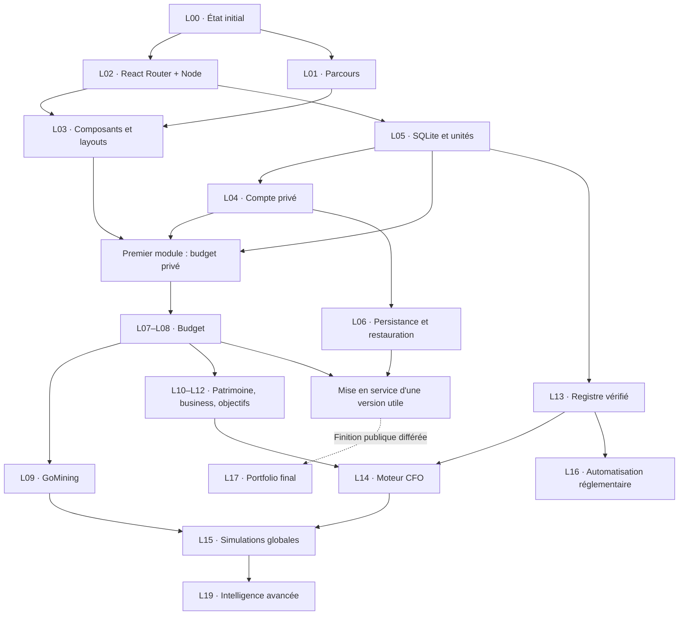

# 13 — Roadmap d'implémentation : portfolio public et CFO privé

Version de travail du **9 septembre 2026**. La stack, le périmètre et la priorité **finance privée / budget d'abord** sont validés ; les modalités de réalisation sont ajustées avec François. **Mise à jour : François a autorisé le démarrage de la migration directe sur `refacto`. Le suivi factuel se trouve dans [18 — Migration du socle](18_MIGRATION_SOCLE.md).**

Préparation Git confirmée le 9 septembre : branche locale **`refacto`** créée depuis **`main` (`c367a1b`)** et sélectionnée. Les modifications locales sont conservées, sans commit ni déploiement. D01 est validé : **comptes, transactions et budget (L07–L08), puis GoMining (L09) et patrimoine (L10)**. Voir [le journal](17_DECISIONS_REALISATION.md).

## 1. Destination et décisions déjà acquises

- Une application React Router en mode framework, React, TypeScript et Node.js.
- Portfolio public ; finance, GoMining, données réelles et projections entièrement privés.
- François seul utilisateur autorisé, avec Better Auth et inscriptions désactivées.
- SQLite + Drizzle + better-sqlite3, calculs avec decimal.js.
- Tailwind/shadcn, Zod/React Hook Form, Recharts, TanStack Table, Vitest et Playwright.
- Serveur avec stockage persistant ; Fly.io à évaluer avant un futur déploiement.
- CFO complet maintenu au programme : budget, patrimoine, business, projets, objectifs, allocation, simulations et données réglementaires.
- GoMining simple : 2 TH / 12 W/TH, apports 30 → 50 → 100 €/mois, accumulation avant 10 TH puis réinvestissement selon les conventions à trancher.
- Démonstration publique, partage avec d'autres utilisateurs et bonus GoMining reportés ou exclus selon le cadrage.
- Monte Carlo et assistant explicatif sont des évolutions ultérieures ; ils ne conditionnent pas la première version utile.

Références : [stack validée](16_ARBITRAGES_STACK_PROJET.md), [GoMining](15_GOMINING_STRATEGIE_SIMULATION.md), [sécurité](11_SECURITE_TESTS_OBSERVABILITE.md).

## 2. Comment piloter le chantier ensemble

1. Présenter un arbitrage concret avec deux ou trois options et une recommandation.
2. François choisit ; consigner sa réponse dans [le journal des décisions de réalisation](17_DECISIONS_REALISATION.md).
3. Mettre à jour uniquement les lots concernés et leurs dépendances.
4. Avant réalisation d'un lot, le découper en petites tâches donnant chacune un résultat vérifiable.
5. Pendant l'implémentation, livrer les écrans avec leur domaine, leur persistance et les contrôles utiles.
6. À la fin d'un lot, montrer le comportement obtenu, les vérifications réalisées et les questions restantes.

Les choix déjà validés ne sont pas rouverts à chaque étape. Les vérifications techniques font partie du travail normal. Les questions portent sur des décisions produit ou des compromis réels, et non sur chaque fichier à modifier.

Chaque lot possède : un identifiant stable, une dépendance, un objectif utilisateur, des tâches, une définition de terminé et, lorsqu'il y en a, un arbitrage préalable.

## 3. Premier arbitrage — premier résultat utile

**D01 validé le 9 septembre 2026 : trajectoire A, budget d'abord.** La partie privée est prioritaire. Le port fonctionnel minimal du portfolio accompagne le socle ; sa finition visuelle et le blog (L17) sont différés après les premiers livrables privés.

Les lots L00 à L06 constituent le socle commun, avec certaines tâches d'exploitation réalisées au moment de la première mise en ligne. Le portfolio existant est porté et reste utilisable dans toutes les trajectoires.

| Trajectoire | Premier module complet après le socle | Suite proposée | Compromis |
|---|---|---|---|
| **A — Budget d'abord, retenu** | Comptes, transactions et dashboard mensuel : L07–L08 | GoMining L09, patrimoine L10, puis reste du CFO | Le simulateur arrive après un premier outil quotidien |
| **B — GoMining d'abord** | Suivi et simulateur privés : L09 | Comptes/budget L07–L08, puis patrimoine et reste du CFO | Le simulateur fonctionne seul au départ ; son rapprochement avec le budget arrive ensuite |
| **C — Portfolio d'abord** | Refonte publique aboutie : L17 | Comptes/budget et GoMining, puis reste du CFO | Priorité au résultat visible professionnellement ; usage financier plus tardif |

Les trajectoires B et C sont conservées pour historique ; elles ne sont pas retenues. D02 est désormais validé : migration directe sur `refacto`. L04 est réalisé pour le compte local unique. **D05 est validé : les premiers comptes utilisent des soldes d’ouverture datés et le journal commence au mois courant.**

## 4. Vue d'ensemble des lots

Avancement du 10 septembre 2026 : **L00 établi, L02 validé localement et L04 réalisé** ([premier lot](18_MIGRATION_SOCLE.md)). **L03 est réalisé au minimum utile** : coque financière responsive, navigation, états vides et formulaires accessibles. **L05 reste partiellement réalisé** : SQLite, migrations, tables du compte, catégories, transactions, budgets, réserve, engagements et scénarios GoMining, unités EUR/BTC et repositories côté serveur. **L07 et L08 sont réalisés localement** : le dashboard mensuel, les prévus/réalisés, la réserve calculée depuis les comptes sélectionnés et les engagements explicitement rapprochés des paiements sont disponibles, sans historique inventé. **L09 est entamé** : l’écran privé de scénarios et le moteur mensuel déterministe couvrent D06, D07 et D12 avec des données synthétiques de test uniquement ; les jalons détaillés et le raccordement budgétaire restent à ajouter. Les routes financières exigent désormais la session du propriétaire, ou restent fermées en `503` sans configuration. [Suivi SQLite et conventions](19_FONDATIONS_SQLITE.md), [authentification](20_AUTHENTIFICATION_COMPTE_UNIQUE.md).

Mise à jour de reprise : **L09 est désormais réalisé** avec jalons, raccordement budgétaire indicatif et historique immuable. **L10 est entamé selon D16** : actifs manuels et valorisations datées, dettes avec états datés et échéancier indicatif ; allocation, mouvements exhaustifs et simulations de remboursement anticipé restent à réaliser.

Charge relative : **S** = lot ciblé ; **M** = plusieurs écrans ou une logique métier substantielle ; **L** = lot à découper en plusieurs incréments. Ce ne sont ni des estimations calendaires ni des promesses de durée.

| Lot | Résultat | Charge | Dépendances principales |
|---|---|---|---|
| L00 | État initial et stratégie de migration définis | S | Choix D02 |
| L01 | Parcours et navigation public/privé cadrés | S | L00 |
| L02 | Portfolio actuel servi par React Router/Node | M | L00 |
| L03 | Composants communs et coque financière | M | L01, L02 |
| L04 | Connexion privée de François uniquement — réalisée localement | M | L02, persistance auth de L05 |
| L05 | Persistance SQLite et conventions financières fiables | M | L02 |
| L06 | Exécution persistante et sauvegarde/restauration vérifiées | M | L02, L04, L05 pour mise en ligne privée |
| L07 | Comptes et journal de transactions utilisables | M | L03–L05 |
| L08 | Budget et dashboard personnel utiles | M | L07 |
| L09 | GoMining : état réel et simulation de capitalisation | L | L03–L05, décisions GoMining |
| L10 | Patrimoine, placements et dettes | L | L07, L05 |
| L11 | Pilotage des activités SaaS et du cash business | L | L07, L05 |
| L12 | Objectifs et projets priorisés | M | L08 ; L10/L11 pour les indicateurs correspondants |
| L13 | Registre réglementaire manuel, daté et vérifié | M | L05 |
| L14 | Allocations CFO explicables et historisées | L | L08, L10, L12 ; L11 si business, L13 si fiscalité |
| L15 | Projections globales et comparaison de scénarios | L | L14, moteurs L09/L10/L11 selon scénario |
| L16 | Actualisation réglementaire et comparaisons de statuts | L | L13 ; L11 pour comparaisons business |
| L17 | Portfolio finalisé, animations et blog | L | L02, L03 ; après les premiers livrables privés selon D01 |
| L18 | Mise en service consolidée et exploitation documentée | M | L06 et lots inclus dans la livraison |
| L19 | Intelligence avancée | L | L15, modèle déterministe validé |

Le numéro identifie un lot ; il n'impose pas un ordre strict. Le registre L13 précède tout calcul qui exige une règle fiscale validée. GoMining L09 reste techniquement autonome, mais vient après L07–L08 dans l'ordre retenu par François.

## 5. Dépendances et jalons

- **J0 — Nouveau socle local** : portfolio actuel porté, layout privé, compte unique, SQLite et conventions financières.
- **J1 — Première version utilisable, retenue** : comptes, transactions, budget et dashboard privés. Une mise en ligne privée inclut les prérequis L06, les contrôles d'accès et la restauration.
- **J2 — Vision personnelle** : budget + GoMining + patrimoine/dettes.
- **J3 — CFO complet déterministe** : business, projets/objectifs, registre vérifié, recommandations et projections.
- **J4 — Version consolidée** : périmètre public finalisé, exploitation documentée, actualisation réglementaire selon les sources disponibles.
- **J5 — Évolutions avancées** : probabilités, scoring et assistant optionnel.

Ces jalons n'exigent pas d'attendre la fin de tout le projet pour utiliser une version fonctionnelle. Les sauvegardes et les contrôles d'accès sont présents dès la première utilisation réelle.

## 6. Lots détaillés

### L00 — Établir l'état de départ et préparer la migration

**But :** disposer d'une référence et préserver le travail existant.

Travail :
- inventorier routes, composants actifs, données publiques, styles, assets, scripts et dépendances ;
- relever les modifications locales existantes, notamment le remplacement d'images, sans les écraser ;
- vérifier le fonctionnement de l'accueil, du CV, des liens et du contact ; constater les tests existants réellement pertinents ;
- repérer les références d'images devenues obsolètes et le test CRA historique à remplacer au moment du port ;
- utiliser la branche `refacto` déjà choisie et définir une méthode de comparaison avec le portfolio actuel ;
- distinguer code et documentation publiables des paramètres financiers privés déjà présents dans le dossier de conception, avant toute future publication.

**Terminé lorsque :** l'inventaire est écrit, les défauts de référence sont identifiés, les changements à préserver sont connus et la stratégie de migration D02 est choisie.

### L01 — Dessiner les parcours et la navigation

**But :** savoir ce que chaque écran permet de faire avant de construire des composants spécifiques.

Travail :
- définir les layouts public, connexion et finance ;
- dessiner les parcours « connexion → synthèse → détail → saisie → résultat » ;
- prévoir navigation desktop/mobile et accès rapide à la saisie ;
- définir les états vide, chargement, erreur, accès refusé et donnée manquante ;
- établir le vocabulaire et les unités : dépense, transfert, apport, récompense, valorisation, projection ;
- produire un plan d'écrans sobre pour le premier module choisi, sans maquetter tout le produit en détail.

**Terminé lorsque :** les parcours du premier module sont clairs et les écrans vides expliquent comment saisir les premières données, sans données de démonstration dans l'application.

### L02 — Migrer le socle vers React Router et Node

**But :** faire fonctionner les pages actuelles sur la stack cible.

Travail :
- créer le socle React Router en mode framework, TypeScript et serveur Node ;
- porter accueil/CV/navigation et assets en conservant leur usage actuel ;
- organiser modules serveur, domaine et composants ; traiter les anciens chemins PUBLIC_URL/GitHub Pages ;
- définir scripts de développement, build, démarrage, types, lint et premiers tests utiles ;
- intégrer les vérifications automatisées au dépôt sans charger de données privées dans les logs ;
- choisir des versions stables compatibles au début de ce lot, sans recopier aveuglément les anciennes recettes.

**Terminé lorsque :** le build et le serveur de production local fonctionnent, une URL ouverte directement fonctionne, le portfolio reste navigable et les contrôles automatisés correspondent au nouveau socle.

La migration complète vers les nouvelles animations n'est pas une condition de ce lot ; elle appartient à L17.

### L03 — Construire le socle visuel commun

**But :** réutiliser les mêmes composants dans tous les modules.

Travail :
- porter les tokens graphite, couleurs sémantiques, typographies et espacements ;
- intégrer Tailwind/shadcn et les composants nécessaires au premier parcours ;
- construire champs, boutons, cartes, dialogues, messages d'erreur et présentation des montants ;
- créer le layout financier et sa navigation ;
- prévoir tableaux et graphiques avec alternatives textuelles ;
- vérifier clavier, focus, mobile et préférences de réduction d'animation.

**Terminé lorsque :** les écrans suivants peuvent assembler ces composants et afficher correctement des montants français, les erreurs et l'absence de données.

### L04 — Mettre en place l'accès privé du compte unique

**But :** permettre à François seul d'utiliser la finance.

Travail :
- arrêter le mode de connexion et de récupération du compte, puis intégrer Better Auth ;
- provisionner le propriétaire unique par une procédure serveur ;
- désactiver inscription, invitations et création automatique d'autres comptes ;
- gérer connexion, déconnexion, expiration et révocation de session ;
- centraliser la vérification serveur de session et de propriétaire et l'appeler sur chaque accès privé ;
- protéger lectures, mutations, exports et futurs simulateurs, même appelés directement.

**Terminé lorsque :** François peut se connecter ; l'accès privé échoue sans session, après déconnexion et avec une autre identité ; les inscriptions échouent ; le portfolio reste public.

**Réalisation :** compte local unique, provisionné par commande serveur. Les secrets sont saisis au moment de la configuration privée, pas dans la documentation versionnée. [Détails et activation](20_AUTHENTIFICATION_COMPTE_UNIQUE.md).

### L05 — Installer SQLite et les fondations du domaine

**But :** disposer de données persistantes et de calculs explicites.

Travail :
- configurer SQLite, Drizzle/better-sqlite3, migrations, clés étrangères et WAL ;
- ajouter d'abord les tables d'authentification et celles du premier module, puis faire évoluer le schéma par lot ;
- définir conventions des identifiants, dates/périodes, devise de référence, unités et précision ;
- créer les outils EUR en centimes, BTC en satoshis et TH avec une précision définie, conversions via decimal.js ;
- définir arrondis, reliquats, saisie décimale et représentation des données manquantes ;
- isoler bases de développement, tests et production, avec repositories côté serveur.

**Terminé lorsque :** une base vide peut être créée par migrations, une base existante peut évoluer sans perdre ses données, les écritures sont atomiques et les opérations monétaires de référence sont vérifiées.

### L06 — Vérifier l'exploitation avant les premières données en ligne

**But :** s'assurer que les données survivent à un redémarrage et peuvent être restaurées.

Travail :
- préparer l'exécution Node de production et son stockage persistant, d'abord localement ;
- tester redémarrage, redéploiement et conservation de SQLite ;
- produire une sauvegarde cohérente avec WAL, la conserver hors du volume et restaurer dans une base séparée ;
- préparer la configuration Fly.io, le dimensionnement et le coût avant remise ;
- déterminer domaine, organisation, sauvegardes privées, démarrage/arrêt et tolérance aux interruptions ;
- vérifier les accès sur l'environnement cible lors de la future mise en ligne.

**Terminé lorsque :** le parcours d'exploitation est reproductible, une restauration a réussi, la configuration et le coût sont documentés. La mise en service avec données réelles exige ces résultats.

**Arbitrages :** D04 pour le moment de la première mise en ligne ; D10 pour les paramètres réels d'exploitation. Préparer ces éléments ne crée pas automatiquement des ressources Fly.io.

### L07 — Comptes et transactions

**But :** enregistrer fidèlement les mouvements réels.

Travail :
- créer comptes, entités économiques, catégories et soldes d'ouverture datés ;
- saisir, corriger et supprimer une transaction avec confirmation adaptée à l'action ;
- distinguer revenus, dépenses et transferts ; relier les deux côtés d'un transfert par une opération atomique ;
- gérer catégories et nature économique, dates, filtres et recherche ;
- calculer le solde depuis l'ouverture et les mouvements enregistrés ;
- vérifier les corrections sans compter un transfert comme revenu/dépense.

**Terminé lorsque :** les soldes se rapprochent des mouvements saisis, les deux côtés d'un transfert restent cohérents et les totaux du mois sont vérifiables.

**Décision D05 :** soldes d’ouverture datés + mois courant. La saisie manuelle est acquise ; un import CSV resterait un ajout ultérieur à décider. Les soldes d’ouverture ne constituent ni un revenu ni une dépense du mois.

**Réalisation locale, 10 septembre 2026 :** comptes, catégories, journal et transferts atomiques sont disponibles dans l’espace privé. Le dashboard du mois affiche revenus, dépenses, surplus, soldes et budgets de dépenses prévu/réel. Il n’invente aucune tendance ou donnée historique. L08 ajoute la réserve de sécurité et les engagements mensuels selon D11.

### L08 — Budget et dashboard personnel

**But :** répondre à « combien entre, combien sort, que reste-t-il ? ».

Travail :
- définir budgets mensuels par catégorie et comparer prévu/réel ;
- afficher revenus, dépenses, surplus et taux d'épargne selon une définition affichée ;
- ajouter tendances 3/6/12 mois quand l'historique existe ;
- suivre réserve de sécurité et engagements récurrents en distinguant prévu et effectivement payé ;
- donner accès depuis un indicateur aux transactions qui l'expliquent ;
- gérer mois incomplets, historiques absents et périodes sans revenu.

**Terminé lorsque :** chaque indicateur peut être expliqué par les données sources et les mouvements prévus ne sont pas confondus avec les paiements réels.

**Réalisation locale, 10 septembre 2026 :** L08 est terminé. La réserve compare une cible saisie au total recalculé des comptes sélectionnés, à la fin de la période affichée. Les engagements mensuels ont une catégorie, un montant, un jour et une plage de validité ; ils ne créent jamais de mouvement. Un paiement est compté seulement lorsqu’une transaction de dépense de même catégorie lui est explicitement rattachée. Les contraintes SQLite et les repositories vérifient propriétaire, catégorie, période et intégrité des liens. Les données et l’absence de configuration restent privées et non mises en cache.

**Livraison A :** première version budgétaire privée utilisable, avec L06 si elle est mise en ligne.

### L09 — GoMining autonome, puis raccordé au CFO

**But :** suivre le mineur et rendre visible la capitalisation selon le scénario demandé.

Travail :
- cadrer D06–D07 : stock BTC avant le seuil, pas de calcul, moment des apports et bascule à 10 TH ;
- vérifier les conditions réelles pertinentes auprès des sources officielles à l'implémentation ;
- saisir l'état réel du mineur et les paramètres économiques datés, sans inventer le coût des 2 TH existants ;
- créer un moteur pur pour les paliers 30/50/100, les récompenses nettes, les conversions et le réinvestissement ;
- conserver les origines de puissance, BTC générés/réinvestis/conservés et EUR personnels ;
- afficher jalons 1/3/5/10 ans, graphique empilé, seuil et tableau accessible ;
- sauvegarder versions des hypothèses et résultats, duplicables ;
- raccorder les apports au budget quand L07–L08 sont disponibles, sans créer automatiquement de transactions réelles.

**Terminé lorsque :** transitions 12/13 et 36/37, seuil exact/jamais atteint, récompenses nulles, reliquats et égalités EUR/BTC/TH sont vérifiés. Chaque TH ajouté a une origine identifiable.

Ce lot n'attend ni le portefeuille SaaS ni le moteur CFO global. Dans la trajectoire B, le raccordement au budget est une sous-tâche explicitement différée jusqu'à L07–L08.

**Décision D06 validée, 10 septembre 2026 :** chaque scénario GoMining proposera un choix modifiable : conserver les BTC accumulés avant 10 TH, ou les réinvestir également au franchissement du seuil. Dans les deux cas, les récompenses produites après le seuil suivent le réinvestissement automatique. Ce choix ne crée aucune transaction réelle et n’altère pas les données observées.

**Décision D07 validée, 10 septembre 2026 :** le moteur utilisera un pas mensuel simplifié. Les entrées, résultats et jalons sont donc exprimés par mois ; aucun calcul journalier implicite ne sera présenté comme une valeur observée.

**Convention D12 validée, 10 septembre 2026 :** dans chaque mois simulé, les récompenses nettes sont d’abord calculées sur la puissance au début du mois ; les apports personnels et éventuels réinvestissements prennent effet à la fin du mois, pour la période suivante.

**Décision D13 réalisée localement, 10 septembre 2026 :** chaque scénario peut lier facultativement ses apports à une catégorie de dépense du propriétaire. Le budget affiche alors l’apport du mois comme une indication distincte ; ni le prévu configuré, ni le réalisé, ni le journal de transactions ne sont modifiés automatiquement. Le lien est validé côté serveur et protégé par des déclencheurs SQLite contre une catégorie d’un autre propriétaire ou de nature incompatible.

**Décision D14 réalisée localement, 10 septembre 2026 :** chaque création et chaque modification de scénario crée une révision complète des hypothèses et paliers. Les révisions sont consultables en lecture seule et des déclencheurs SQLite empêchent leur modification ou leur suppression. Pour préserver cette traçabilité, l’interface ne propose plus la suppression d’un scénario.

**Décision D15 réalisée localement, 10 septembre 2026 :** une ancienne version peut être appliquée au scénario courant. Le résultat est toujours une nouvelle révision complète ; l’ancienne hypothèse reste intacte. La mutation est contrôlée côté serveur, avec vérification de propriété de la version et de la catégorie de budget restaurée.

### L10 — Patrimoine, investissements et dettes

**But :** connaître ce qui est détenu, ce qui est dû et son évolution.

Travail :
- enregistrer actifs et positions par enveloppe/classe, apports et valorisations datées ;
- distinguer capital versé, quantité détenue et valeur estimée ;
- enregistrer dettes, capital restant, mensualités, taux et durées ;
- calculer un échéancier et séparer intérêts et remboursement de capital ;
- construire patrimoine brut/net, allocation et snapshots mensuels ;
- raccorder les comptes liquides et GoMining sans compter deux fois les mêmes valeurs ;
- préparer simulations de remboursement anticipé/renégociation pour L15.

**Terminé lorsque :** les actifs et dettes expliquent le patrimoine net, les liquidités ne sont comptées qu'une fois et le coût d'achat des TH n'est pas présenté comme une valeur de revente certaine.

**Premier incrément réalisé localement, 10 septembre 2026 (D16, option A) :**
les actifs hors comptes portent une quantité descriptive, le capital versé et
des valorisations datées. Les dettes reçoivent des états datés avec capital
restant dû, mensualité, taux et durée ; un échéancier indicatif distingue
intérêts et capital. Les liquidités sont recalculées exclusivement depuis les
comptes et GoMining reste exclu du bilan, car il s'agit d'une projection sans
valeur de revente certaine. Allocation, suivi détaillé de mouvements et
simulations de remboursement anticipé sont différés.

**Complément réalisé localement, 11 septembre 2026 (D17, option A) :** une
position unique de BTC réellement observés chez GoMining peut être saisie en
satoshis avec sa valorisation datée. Elle exclut toujours les TH, les
récompenses projetées et toute valeur implicite du contrat ; elle ne se
synchronise pas avec le simulateur.

**Complément réalisé localement, 11 septembre 2026 (D18, option A) :** le
bilan affiche la répartition observée des actifs bruts par liquidités et classe
d'actif. Les pourcentages sont calculés à partir des seules valeurs datées
disponibles ; dettes, cibles et recommandations de rééquilibrage sont exclus.

### L11 — Business et portfolio de SaaS

**But :** séparer activité économique et argent disponible pour le foyer.

Travail :
- enregistrer activités, produits, statuts juridiques et historique ;
- saisir CA, MRR, charges, temps de maintenance et métriques par période ;
- distinguer recettes, marge, provisions, cash conservé, réinvesti et distribuable ;
- calculer ARR à partir du MRR, sans le confondre avec le CA encaissé annuel ;
- suivre distributions foyer/business et investissements sans double comptage ;
- afficher concentration du revenu et stabilité d'App1 ;
- permettre une saisie explicite des provisions tant qu'un calcul réglementaire validé n'est pas disponible.

**Terminé lorsque :** chaque euro distribué peut être expliqué et le CA n'est jamais présenté comme revenu personnel net.

Les projections fiscales automatiques dépendent de L13. Une saisie manuelle documentée permet un premier usage sans taux fiscal inventé.

### L12 — Objectifs et projets

**But :** organiser les priorités et les décisions d'investissement.

Travail :
- gérer objectifs, montants cibles, dates, priorités et progression ;
- relier sécurité, matériel, patrimoine et projets aux données disponibles ;
- gérer backlog de projets, statuts, coût, capacité et prochaines actions ;
- rendre la priorité modifiable au clavier et par boutons ; compléter par drag & drop ;
- calculer les conditions App2 à partir de la stabilité d'App1, du cash et de la capacité ;
- distinguer hypothèses de ROI/confiance et performances observées.

**Terminé lorsque :** les projets peuvent être priorisés et les raisons d'éligibilité ou de blocage sont visibles, avec les limites de projets actifs du cadrage.

### L13 — Registre réglementaire manuel vérifié

**But :** fournir des règles datées aux calculs qui en dépendent.

Travail :
- construire saisie/consultation des valeurs, périodes de validité et sources ;
- conserver versions précédentes et date de vérification ;
- vérifier les premières valeurs nécessaires auprès de sources officielles ;
- résoudre la règle applicable à une date et traiter les chevauchements/absences ;
- marquer les calculs impossibles lorsque la donnée requise manque ;
- distinguer règle vérifiée et hypothèse personnalisée de scénario.

**Terminé lorsque :** une ancienne simulation retrouve les règles qu'elle utilisait et aucune valeur fiscale manquante n'est remplacée silencieusement par zéro ou une constante non vérifiée.

L'ingestion automatisée est L16. Ce registre minimal passe avant toute fonctionnalité qui prétend calculer automatiquement charges ou fiscalité.

### L14 — Moteur CFO explicable

**But :** proposer quoi faire du cash disponible avec une justification vérifiable.

Travail :
- construire un contexte daté : liquidités, obligations, sécurité, patrimoine, risque, projets et business disponible ;
- implémenter priorités et règles configurables, modes stratégiques et renormalisation ;
- respecter obligations, objectif de sécurité et plafond spéculatif ;
- proposer l'allocation entre placements, business, matériel, projets et opportunités ;
- persister chaque exécution avec entrées, version des règles, calcul et décisions ;
- permettre accepter/modifier/ignorer une proposition et comparer une alternative ;
- signaler les données insuffisantes et les conflits avec le calendrier GoMining.

**Terminé lorsque :** les allocations restent dans le cash allouable, les priorités sont respectées et chaque montant se rattache à une règle et à ses données sources.

Accepter une proposition enregistre un plan interne ; cela ne passe aucun ordre et ne prouve pas qu'un paiement réel a eu lieu. Un contexte sans business est possible ; les règles dépendantes d'un module absent sont explicitement indisponibles.

### L15 — Simulations globales et comparaison

**But :** projeter les choix sur 5/10/20 ans et comprendre leurs effets.

Travail :
- orchestrer le pas mensuel : revenus, dépenses, événements, décisions CFO, placements et dettes ;
- brancher les moteurs métier, dont GoMining avec agrégation mensuelle si son calcul est journalier ;
- gérer scénarios prudent, central, ambitieux et personnalisé avec hypothèses modifiables ;
- intégrer courbes de revenus des apps et conditions de lancement ;
- comparer placements, réinvestissement business, matériel et remboursement du prêt ;
- enregistrer entrées, version du moteur, données réglementaires et résultats ;
- afficher patrimoine, cash minimum, dette, progression des objectifs et explications.

**Terminé lorsque :** une exécution déterministe est reproductible et aucune simulation ne modifie le journal réel. Pas de double application d'un rendement aux TH, ni de double comptage du cash business ou des apports.

### L16 — Actualisation réglementaire et comparateur de statuts

**But :** réduire la saisie et préparer des revues de structure sur des données vérifiées.

Travail :
- étudier les sources officielles effectivement disponibles, leurs formats et conditions ;
- ajouter providers, cache, dates de fraîcheur et détection des changements ;
- prévoir une tâche de rafraîchissement compatible avec les paramètres d'arrêt/démarrage de l'hébergement ;
- exiger une validation humaine des extractions incertaines et conserver les valeurs antérieures ;
- construire les comparaisons de statuts prévues dans le dossier ;
- afficher hypothèses, limites et besoin de revue professionnelle quand pertinent.

**Terminé lorsque :** une panne de source ne détruit pas l'historique, les données périmées sont identifiées et aucune bascule de statut n'est déclenchée automatiquement.

### L17 — Finaliser le portfolio et le blog

**But :** obtenir la présentation professionnelle prévue par le design system.

Travail :
- finaliser hero, sections projets, compétences, parcours, contact et CV ;
- mettre en place les interactions narratives utiles avec GSAP/ScrollTrigger ;
- ajuster images, responsive, accessibilité et performances ;
- cadrer le contenu du blog puis construire listing et articles ;
- compléter métadonnées et sitemap pour les seules pages publiques ;
- vérifier le formulaire de contact sans envois réels pendant les tests ;
- garder la finance et ses données hors des contenus publics.

**Terminé lorsque :** les parcours publics fonctionnent sur mobile/desktop, les animations respectent reduced motion et le blog publie seulement le contenu explicitement préparé pour lui.

**Arbitrages :** D08 pour la profondeur de la refonte, D09 pour le blog. Lenis/Motion ne sont pas nécessaires au fonctionnement financier.

### L18 — Consolider la mise en service

**But :** rendre l'application exploitable et maintenable au quotidien.

Travail :
- valider les parcours retenus pour la version, les migrations et le retour à une version applicative compatible ;
- vérifier sauvegardes, restauration, sessions et confinement des données sur l'environnement réel ;
- documenter configuration, démarrage, mise à jour, récupération du compte et procédure de reprise ;
- mesurer ressources utilisées et facturation de l'organisation d'hébergement ;
- mettre en place des journaux utiles sans données financières ni secrets ;
- retirer CRA et les dépendances effectivement remplacées après validation ;
- traiter les défauts bloquants et conserver les améliorations secondaires dans un backlog.

**Terminé lorsque :** François peut utiliser la version, comprendre son exploitation et récupérer ses données en cas d'incident.

Ce lot consolide L06 ; il ne repousse pas les sauvegardes ou la confidentialité à la fin du projet.

### L19 — Intelligence avancée, après validation du modèle déterministe

**But :** enrichir la décision lorsque les données et moteurs de base sont fiables.

Travail envisageable :
- Monte Carlo avec distributions explicites, dépendances et graine reproductible ;
- P10/médiane/P90 et probabilité d'atteindre un objectif ;
- scoring dynamique des projets avec hypothèses visibles ;
- assistant expliquant les calculs et l'historique ;
- mesurer l'apport de chaque évolution avant d'augmenter la complexité.

**Terminé lorsque :** les sorties probabilistes sont expliquées et évaluées. L'IA reste une couche d'explication, sans remplacer les calculs financiers déterministes.

L'assistant est optionnel. Tout recours à un service IA externe devra faire l'objet d'un arbitrage dédié sur les données transmises, conformément au périmètre privé.

## 7. Définition commune d'un lot terminé

- Le parcours prévu fonctionne avec données saisies ou état vide explicite.
- Les lectures/écritures privées sont contrôlées côté serveur.
- Le domaine est séparé des composants et les entrées sont validées.
- Les données persistent, les migrations sont cohérentes et les calculs peuvent être expliqués.
- Les vérifications adaptées ont réussi : calculs et accès pour les lots financiers, parcours UI lorsque pertinent.
- Les erreurs utiles, l'accessibilité et le mobile sont traités pour le périmètre du lot.
- Les décisions et limites restantes sont documentées.
- Aucune donnée réelle n'est transformée en fixture publique ; les données de tests restent isolées.

Tous les lots ne nécessitent pas une nouvelle suite E2E complète : privilégier les tests qui vérifient les risques et comportements nouveaux.

## 8. Première séquence d'exécution proposée

La branche `refacto` est active ; D01 valide budget d'abord et D02 la migration directe. Avancement de la première séquence :
1. L00 réalisé : état de départ et méthode de migration documentés.
2. L02 réalisé et vérifié : portfolio porté. Cadrer maintenant les premiers parcours de L01.
3. Réalisé au minimum utile : L03, coque financière et navigation du premier module.
4. Réalisé : conventions L05, tables d'auth et L04 ; compléter L05 par les modèles des lots suivants.
5. Réalisé localement selon D05 et D11 : comptes avec soldes d’ouverture datés, catégories, transactions, budget mensuel, réserve et engagements récurrents. Vérifier L06 avant toute mise en ligne.
6. Démontrer J1, puis préparer GoMining (L09) avec l’arbitrage D07 et patrimoine (L10). La finition du portfolio (L17) vient après les premiers livrables privés.

Les lots suivants seront eux-mêmes découpés avant réalisation. Aucun besoin de trancher aujourd'hui toutes les règles fiscales, tous les graphiques ou tous les futurs écrans.

## 9. Correspondance avec la roadmap initiale

| Ancien ensemble | Lots de cette roadmap |
|---|---|
| P0 Fondation | L00 à L06 |
| P1 Budget | L07–L08 |
| P2 Patrimoine | L10 |
| P3 Business | L11 |
| P4 Projects & Goals | L12 |
| P5 CFO Engine | L14 |
| P6 Simulation | L09 et L15 |
| P7 Regulatory | L13 et L16 |
| P8 Intelligence avancée | L19 |
| Refonte portfolio et mise en service | L17 et L18 |

Aucun module du dossier initial n'est supprimé. Les briques nécessaires plus tôt, notamment registre vérifié, authentification et sauvegardes, sont placées avant leurs usages.
